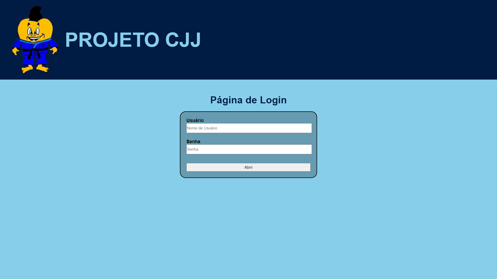
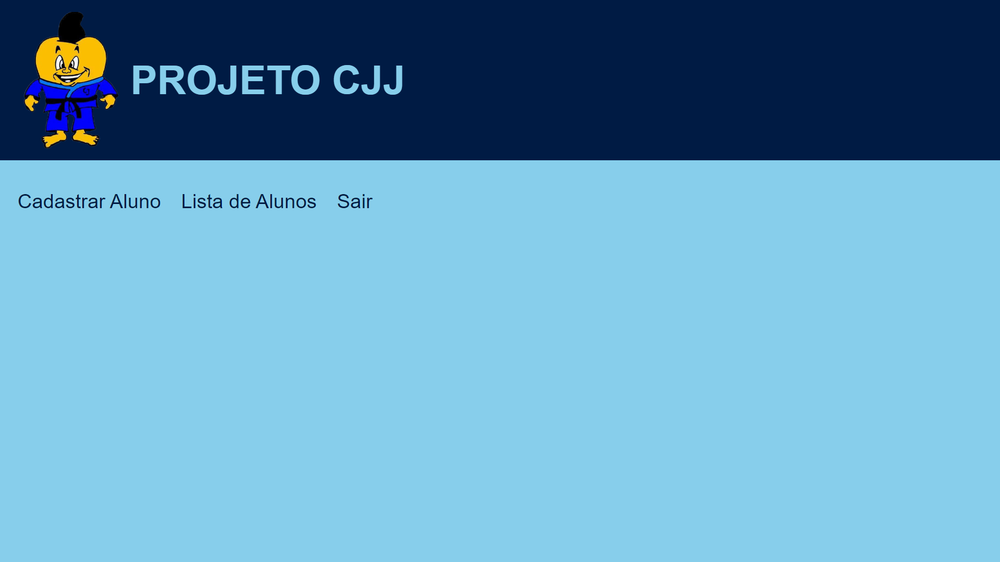
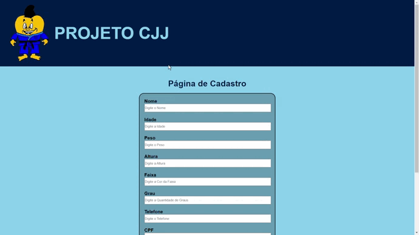
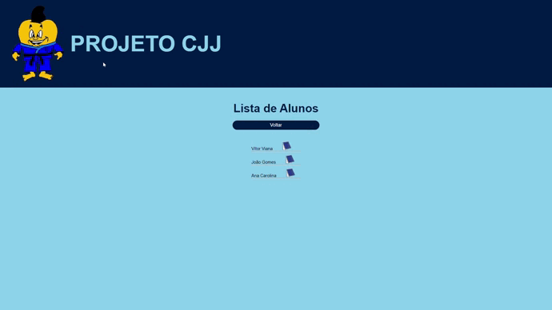
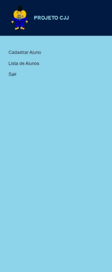

# Web App CJJ 

## Descrição
Esse projeto eu criei com o intuito de ajudar os meus professores, do Projeto Acolher, mas especificamente na parte do jiu-jitsu.
Já fazia algum tempo que meus professores estavam reclamando, sobre a dificuldade de controlar a frequência dos alunos durante as aulas. E eu também havia observado, que sempre quando chegava nos dias de inscrições dos campeonatos, o professor sempre pedia as mesmas coisas: identidade, cpf, idade, nome, faixa e etc. Ai foi onde eu lembrei, cara eu sou um programador, porque não tentar resolver este problema. Começei a juntar todos os meus conhecimentos, adquiridos com os meus anos de estudos na faculdade, e a partir deste momento, começou minha aventura. 
Passei por inúmeros desafios, durante está trajetória, até conseguir terminar o projeto. Um dos primeiros problemas que tive, foi que eu não sabia quase nada de bancos de dados, segundo problema meus conhecimentos em HTML e CSS eram muito superficial e eu precisava criar um projeto 100% responsivo, desta forma, tive que comessar a estudar um pouco mais sobre banco de dados, e HTML e CSS, completada está etapa, fui para o procimo desafio, o terceiro e não ultimo, mais o que quase me fez desistir, foi que, como teria informações sigilosas no sistema, como o cpf e a identidade do aluno, não poderia deixar essas informações abertas para qualquer pessoa acessar, então tive que criar uma seção de login do usuário, só que naquele momento, não fazia ideia de como fazer isso, e eu pesquisava e implementava, pesquisava e implementava, e o código nunca dava certo, quando estava quase desistindo, consegui descobri o problema, ainda bem! KKKKKK. 
Esses foram alguns dos desafios que tive, mas que me ensinaram muito, principalmente a perseverar e não desistir.
 
## Tecnologias usadas
 - Python==3.10.0
 - Flask==2.0.2
 - Flask-SQLAlchemy==2.5.1
 - Flask-Login==0.5.0
 - HTML5
 - CSS3
 - SQLite

---

## Página de Login

## Página Inicial

## Página de Cadastro

## Lista de Alunos

## Páginas 100% Responsivas

